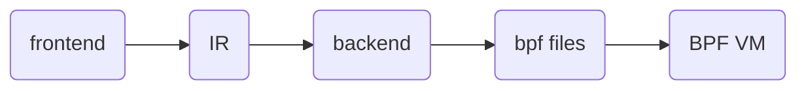

# ccbpf
A lightweight compiler and virtual machine designed for embedded systems. Inspired by eBPF, built for MCU.

## Overview

This project is a lightweight language runtime designed for embedded systems— a compiler and virtual machine that can run on MCUs, inspired by eBPF but smaller, simpler, and far more portable.

It enables developers to inject dynamic hook code into components such as RTOS kernels, network protocol stacks, and file systems without recompiling firmware, providing a flexible and safe extension mechanism for embedded environments.

Of course, it can also run on general‑purpose operating systems like Linux, where it can serve as an extensible scripting engine or a safe, embeddable runtime for dynamic application logic.

## design



The documents:   [设计文档](docs/中文/设计文档.md)

## Project Status

This project is currently paused for a bit. Since the final target is an embedded platform, I need to build a full embedded operating system first — including a shell, a simple text editor, and other basic system components.

Once that foundation is ready, I’ll continue developing **ccbpf** directly inside the embedded environment, where it’s meant to run.

Stay tuned — the fun part is coming after the OS groundwork is done.

## run

```
mkdir build
cmake ..
make
./ccbpf
```

like this:

```
skaiuijing@ubuntu:~/compiler/build$ ./ccbpf 
TOKEN: tag=282, str={
TOKEN: tag=257, str=int
TOKEN: tag=268, str=a
TOKEN: tag=285, str=;
TOKEN: tag=257, str=int
TOKEN: tag=268, str=b
TOKEN: tag=285, str=;
TOKEN: tag=257, str=int
TOKEN: tag=268, str=c
TOKEN: tag=285, str=;
TOKEN: tag=257, str=int
TOKEN: tag=268, str=arr
TOKEN: tag=301, str=[
TOKEN: tag=273, str=4
TOKEN: tag=302, str=]
TOKEN: tag=285, str=;
TOKEN: tag=268, str=a
TOKEN: tag=293, str==
TOKEN: tag=273, str=3
TOKEN: tag=285, str=;
TOKEN: tag=268, str=b
TOKEN: tag=293, str==
TOKEN: tag=273, str=4
TOKEN: tag=285, str=;
TOKEN: tag=268, str=c
TOKEN: tag=293, str==
TOKEN: tag=268, str=a
TOKEN: tag=288, str=+
TOKEN: tag=268, str=b
TOKEN: tag=290, str=*
TOKEN: tag=273, str=2
TOKEN: tag=285, str=;
TOKEN: tag=268, str=arr
TOKEN: tag=301, str=[
TOKEN: tag=273, str=1
TOKEN: tag=302, str=]
TOKEN: tag=293, str==
TOKEN: tag=268, str=c
TOKEN: tag=285, str=;
TOKEN: tag=268, str=a
TOKEN: tag=293, str==
TOKEN: tag=268, str=arr
TOKEN: tag=301, str=[
TOKEN: tag=273, str=1
TOKEN: tag=302, str=]
TOKEN: tag=285, str=;
TOKEN: tag=269, str=if
TOKEN: tag=280, str=(
TOKEN: tag=268, str=a
TOKEN: tag=263, str=<
TOKEN: tag=268, str=b
TOKEN: tag=256, str=&&
TOKEN: tag=268, str=c
TOKEN: tag=265, str===
TOKEN: tag=273, str=10
TOKEN: tag=281, str=)
TOKEN: tag=282, str={
TOKEN: tag=268, str=c
TOKEN: tag=293, str==
TOKEN: tag=268, str=c
TOKEN: tag=289, str=-
TOKEN: tag=273, str=1
TOKEN: tag=285, str=;
TOKEN: tag=283, str=}
TOKEN: tag=269, str=if
TOKEN: tag=280, str=(
TOKEN: tag=268, str=a
TOKEN: tag=264, str=>
TOKEN: tag=268, str=b
TOKEN: tag=274, str=||
TOKEN: tag=279, str=#279
TOKEN: tag=280, str=(
TOKEN: tag=268, str=c
TOKEN: tag=265, str===
TOKEN: tag=273, str=10
TOKEN: tag=281, str=)
TOKEN: tag=281, str=)
TOKEN: tag=282, str={
TOKEN: tag=268, str=c
TOKEN: tag=293, str==
TOKEN: tag=268, str=c
TOKEN: tag=288, str=+
TOKEN: tag=273, str=1
TOKEN: tag=285, str=;
TOKEN: tag=283, str=}
TOKEN: tag=269, str=if
TOKEN: tag=280, str=(
TOKEN: tag=279, str=#279
TOKEN: tag=280, str=(
TOKEN: tag=268, str=a
TOKEN: tag=263, str=<
TOKEN: tag=268, str=b
TOKEN: tag=281, str=)
TOKEN: tag=256, str=&&
TOKEN: tag=279, str=#279
TOKEN: tag=280, str=(
TOKEN: tag=268, str=c
TOKEN: tag=272, str=!=
TOKEN: tag=273, str=10
TOKEN: tag=281, str=)
TOKEN: tag=281, str=)
TOKEN: tag=282, str={
TOKEN: tag=268, str=c
TOKEN: tag=293, str==
TOKEN: tag=268, str=c
TOKEN: tag=288, str=+
TOKEN: tag=273, str=2
TOKEN: tag=285, str=;
TOKEN: tag=283, str=}
TOKEN: tag=283, str=}
TOKEN: tag=0, str=#0
L1:
[IR] LABEL L1
[IR] MOVE  t1 <- 3
        a = 3
[IR] STORE MEM[0 + t0 * 4] <- t1
L3:
[IR] LABEL L3
[IR] MOVE  t2 <- 4
        b = 4
[IR] STORE MEM[4 + t0 * 4] <- t2
L4:
[IR] LABEL L4
[IR] LOAD  t4 <- MEM[0 + t0 * 4]
[IR] LOAD  t6 <- MEM[4 + t0 * 4]
[IR] MOVE  t7 <- 2
[IR] MUL   t5 <- t6 * t7
[IR] ADD   t3 <- t4 + t5
        c = a + b * 2
[IR] STORE MEM[8 + t0 * 4] <- t3
L5:
[IR] LABEL L5
[IR] LOAD  t8 <- MEM[8 + t0 * 4]
        arr [ 1 ] = c
[IR] STORE MEM[16 + t0 * 4] <- t8
L6:
[IR] LABEL L6
[IR] LOAD  t9 <- MEM[16 + t0 * 4]
        a = arr [ 1 ]
[IR] STORE MEM[0 + t0 * 4] <- t9
L7:
[IR] LABEL L7
[IR] LOAD  t4 <- MEM[0 + t0 * 4]
[IR] LOAD  t6 <- MEM[4 + t0 * 4]
[IR] IFFALSE !(t4 >= t6) goto L8
        iffalse a < b goto L8
[IR] LOAD  t8 <- MEM[8 + t0 * 4]
[IR] MOVE  t10 <- 10
[IR] IFFALSE !(t8 == t10) goto L8
        iffalse c == 10 goto L8
L9:
[IR] LABEL L9
[IR] LOAD  t8 <- MEM[8 + t0 * 4]
[IR] MOVE  t12 <- 1
[IR] SUB   t11 <- t8 - t12
        c = c - 1
[IR] STORE MEM[8 + t0 * 4] <- t11
L8:
[IR] LABEL L8
[IR] LOAD  t4 <- MEM[0 + t0 * 4]
[IR] LOAD  t6 <- MEM[4 + t0 * 4]
        if a > b goto L12
[IR] LOAD  t8 <- MEM[8 + t0 * 4]
[IR] MOVE  t13 <- 10
        if c == 10 goto L10
L12:
[IR] LABEL L12
L11:
[IR] LABEL L11
[IR] LOAD  t8 <- MEM[8 + t0 * 4]
[IR] MOVE  t15 <- 1
[IR] ADD   t14 <- t8 + t15
        c = c + 1
[IR] STORE MEM[8 + t0 * 4] <- t14
L10:
[IR] LABEL L10
[IR] LOAD  t4 <- MEM[0 + t0 * 4]
[IR] LOAD  t6 <- MEM[4 + t0 * 4]
        if a < b goto L2
[IR] LOAD  t8 <- MEM[8 + t0 * 4]
[IR] MOVE  t16 <- 10
        if c != 10 goto L2
L13:
[IR] LABEL L13
[IR] LOAD  t8 <- MEM[8 + t0 * 4]
[IR] MOVE  t18 <- 2
[IR] ADD   t17 <- t8 + t18
        c = c + 2
[IR] STORE MEM[8 + t0 * 4] <- t17
L2:
[IR] LABEL L2
BPF sum result: 150
patch_jumps: pj_count=2, insn_count=92
 pending[0]: insn=38, label=8, is_cond=1, true_branch=0
 pending[1]: insn=45, label=8, is_cond=1, true_branch=0
  patch[0]: from=38 -> to=56 (rel=17)
  patch[1]: from=45 -> to=56 (rel=10)
BPF program (92 insns):
  0: code=0x0000 jt=0 jf=0 k=3
  1: code=0x0002 jt=0 jf=0 k=9
  2: code=0x0060 jt=0 jf=0 k=9
  3: code=0x0002 jt=0 jf=0 k=0
  4: code=0x0000 jt=0 jf=0 k=4
  5: code=0x0002 jt=0 jf=0 k=10
  6: code=0x0060 jt=0 jf=0 k=10
  7: code=0x0002 jt=0 jf=0 k=1
  8: code=0x0060 jt=0 jf=0 k=0
  9: code=0x0002 jt=0 jf=0 k=12
 10: code=0x0060 jt=0 jf=0 k=1
 11: code=0x0002 jt=0 jf=0 k=14
 12: code=0x0000 jt=0 jf=0 k=2
 13: code=0x0002 jt=0 jf=0 k=15
 14: code=0x0060 jt=0 jf=0 k=14
 15: code=0x0061 jt=0 jf=0 k=15
 16: code=0x002c jt=0 jf=0 k=0
 17: code=0x0002 jt=0 jf=0 k=13
 18: code=0x0060 jt=0 jf=0 k=12
 19: code=0x0061 jt=0 jf=0 k=13
 20: code=0x000c jt=0 jf=0 k=0
 21: code=0x0002 jt=0 jf=0 k=11
 22: code=0x0060 jt=0 jf=0 k=11
 23: code=0x0002 jt=0 jf=0 k=2
 24: code=0x0060 jt=0 jf=0 k=2
 25: code=0x0002 jt=0 jf=0 k=16
 26: code=0x0060 jt=0 jf=0 k=16
 27: code=0x0002 jt=0 jf=0 k=4
 28: code=0x0060 jt=0 jf=0 k=4
 29: code=0x0002 jt=0 jf=0 k=17
 30: code=0x0060 jt=0 jf=0 k=17
 31: code=0x0002 jt=0 jf=0 k=0
 32: code=0x0060 jt=0 jf=0 k=0
 33: code=0x0002 jt=0 jf=0 k=12
 34: code=0x0060 jt=0 jf=0 k=1
 35: code=0x0002 jt=0 jf=0 k=14
 36: code=0x0060 jt=0 jf=0 k=12
 37: code=0x0061 jt=0 jf=0 k=14
 38: code=0x003d jt=0 jf=17 k=0
 39: code=0x0060 jt=0 jf=0 k=2
 40: code=0x0002 jt=0 jf=0 k=16
 41: code=0x0000 jt=0 jf=0 k=10
 42: code=0x0002 jt=0 jf=0 k=18
 43: code=0x0060 jt=0 jf=0 k=16
 44: code=0x0061 jt=0 jf=0 k=18
 45: code=0x001d jt=0 jf=10 k=0
 46: code=0x0060 jt=0 jf=0 k=2
 47: code=0x0002 jt=0 jf=0 k=16
 48: code=0x0000 jt=0 jf=0 k=1
 49: code=0x0002 jt=0 jf=0 k=20
 50: code=0x0060 jt=0 jf=0 k=16
 51: code=0x0061 jt=0 jf=0 k=20
 52: code=0x001c jt=0 jf=0 k=0
 53: code=0x0002 jt=0 jf=0 k=19
 54: code=0x0060 jt=0 jf=0 k=19
 55: code=0x0002 jt=0 jf=0 k=2
 56: code=0x0060 jt=0 jf=0 k=0
 57: code=0x0002 jt=0 jf=0 k=12
 58: code=0x0060 jt=0 jf=0 k=1
 59: code=0x0002 jt=0 jf=0 k=14
 60: code=0x0060 jt=0 jf=0 k=2
 61: code=0x0002 jt=0 jf=0 k=16
 62: code=0x0000 jt=0 jf=0 k=10
 63: code=0x0002 jt=0 jf=0 k=21
 64: code=0x0060 jt=0 jf=0 k=2
 65: code=0x0002 jt=0 jf=0 k=16
 66: code=0x0000 jt=0 jf=0 k=1
 67: code=0x0002 jt=0 jf=0 k=23
 68: code=0x0060 jt=0 jf=0 k=16
 69: code=0x0061 jt=0 jf=0 k=23
 70: code=0x000c jt=0 jf=0 k=0
 71: code=0x0002 jt=0 jf=0 k=22
 72: code=0x0060 jt=0 jf=0 k=22
 73: code=0x0002 jt=0 jf=0 k=2
 74: code=0x0060 jt=0 jf=0 k=0
 75: code=0x0002 jt=0 jf=0 k=12
 76: code=0x0060 jt=0 jf=0 k=1
 77: code=0x0002 jt=0 jf=0 k=14
 78: code=0x0060 jt=0 jf=0 k=2
 79: code=0x0002 jt=0 jf=0 k=16
 80: code=0x0000 jt=0 jf=0 k=10
 81: code=0x0002 jt=0 jf=0 k=24
 82: code=0x0060 jt=0 jf=0 k=2
 83: code=0x0002 jt=0 jf=0 k=16
 84: code=0x0000 jt=0 jf=0 k=2
 85: code=0x0002 jt=0 jf=0 k=26
 86: code=0x0060 jt=0 jf=0 k=16
 87: code=0x0061 jt=0 jf=0 k=26
 88: code=0x000c jt=0 jf=0 k=0
 89: code=0x0002 jt=0 jf=0 k=25
 90: code=0x0060 jt=0 jf=0 k=25
 91: code=0x0002 jt=0 jf=0 k=2
Wrote out.ccbpf (94 instructions)
BPF VM result = 14
```

