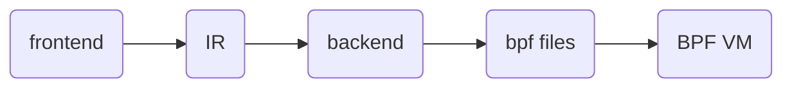

# ccbpf
A lightweight compiler and virtual machine designed for embedded systems. Inspired by eBPF, built for MCU.

## Overview

This project is a lightweight language runtime designed for embedded systems— a compiler and virtual machine that can run on MCUs, inspired by eBPF but smaller, simpler, and far more portable.

It enables developers to inject dynamic hook code into components such as RTOS kernels, network protocol stacks, and file systems without recompiling firmware, providing a flexible and safe extension mechanism for embedded environments.

Of course, it can also run on general‑purpose operating systems like Linux, where it can serve as an extensible scripting engine or a safe, embeddable runtime for dynamic application logic.

## design



The documents:   [设计文档](docs/中文/设计文档.md)

## use

hook:

```c
int test_pkt(uint8_t *packet, int len)
{
    struct ccbpf_program prog = ccbpf_load("out.ccbpf"); //or your ccbpf files

    uint32_t r = ccbpf_run_pkt(&prog, packet, len);

    ccbpf_unload(&prog);

    return r;
}

int main(void)
{
    compiler_test();  
    
    uint8_t buf[64] = {0};

    buf[34] = 254;
    buf[35] = 0;
    buf[36] = 0;
    buf[37] = 1;

    printf("result = %d\n", test_pkt(buf, 64));  

    return 0;
}
```

edit:

```c
struct udp_hdr {
    unsigned short sport;
    unsigned short dport;
};

int hook(void *ctx, char *pkt)
{
    unsigned int x;
    unsigned int y;
    struct udp_hdr *uh;

    uh = (struct udp_hdr *)&pkt[34];
    x = ntohs(uh->sport);
    print(x);
    y = uh->dport;
    print(y);
    return x + y;
}
```

run:

```
mkdir build
cmake ..
make
./ccbpf
```

output:

We can hook the value of udp_hdr, then print and return it.

You can drop the packet by the value of return.

```c
skaiuijing@ubuntu:~/compiler/build$ ./ccbpf 
TOKEN: tag=289, str=struct
TOKEN: tag=268, str=udp_hdr
TOKEN: tag=283, str={
TOKEN: tag=257, str=unsigned
TOKEN: tag=257, str=short
TOKEN: tag=268, str=sport
TOKEN: tag=286, str=;
TOKEN: tag=257, str=unsigned
TOKEN: tag=257, str=short
TOKEN: tag=268, str=dport
TOKEN: tag=286, str=;
TOKEN: tag=284, str=}
TOKEN: tag=286, str=;
TOKEN: tag=257, str=int
TOKEN: tag=268, str=hook
TOKEN: tag=281, str=(
TOKEN: tag=268, str=void
TOKEN: tag=292, str=*
TOKEN: tag=268, str=ctx
TOKEN: tag=285, str=,
TOKEN: tag=257, str=char
TOKEN: tag=292, str=*
TOKEN: tag=268, str=pkt
TOKEN: tag=282, str=)
TOKEN: tag=283, str={
TOKEN: tag=257, str=unsigned
TOKEN: tag=257, str=int
TOKEN: tag=268, str=x
TOKEN: tag=286, str=;
TOKEN: tag=257, str=unsigned
TOKEN: tag=257, str=int
TOKEN: tag=268, str=y
TOKEN: tag=286, str=;
TOKEN: tag=289, str=struct
TOKEN: tag=268, str=udp_hdr
TOKEN: tag=292, str=*
TOKEN: tag=268, str=uh
TOKEN: tag=286, str=;
TOKEN: tag=268, str=uh
TOKEN: tag=295, str==
TOKEN: tag=281, str=(
TOKEN: tag=289, str=struct
TOKEN: tag=268, str=udp_hdr
TOKEN: tag=292, str=*
TOKEN: tag=282, str=)
TOKEN: tag=261, str=&
TOKEN: tag=268, str=pkt
TOKEN: tag=303, str=[
TOKEN: tag=273, str=34
TOKEN: tag=304, str=]
TOKEN: tag=286, str=;
TOKEN: tag=268, str=x
TOKEN: tag=295, str==
TOKEN: tag=268, str=ntohs
TOKEN: tag=281, str=(
TOKEN: tag=268, str=uh
TOKEN: tag=279, str=->
TOKEN: tag=268, str=sport
TOKEN: tag=282, str=)
TOKEN: tag=286, str=;
TOKEN: tag=268, str=print
TOKEN: tag=281, str=(
TOKEN: tag=268, str=x
TOKEN: tag=282, str=)
TOKEN: tag=286, str=;
TOKEN: tag=268, str=y
TOKEN: tag=295, str==
TOKEN: tag=268, str=uh
TOKEN: tag=279, str=->
TOKEN: tag=268, str=dport
TOKEN: tag=286, str=;
TOKEN: tag=268, str=print
TOKEN: tag=281, str=(
TOKEN: tag=268, str=y
TOKEN: tag=282, str=)
TOKEN: tag=286, str=;
TOKEN: tag=287, str=return
TOKEN: tag=268, str=x
TOKEN: tag=290, str=+
TOKEN: tag=268, str=y
TOKEN: tag=286, str=;
TOKEN: tag=284, str=}
TOKEN: tag=0, str=#0
[PP] block root stmt=0xddff60 tag=20
[PP] root stmt=0xddff60 tag=20
L1:
[IR] LABEL L1
L3:
[IR] LABEL L3
[IR] LOAD_PKT t2 <- PKT[34] (size=2)
[IR] LOAD_PKT t2 <- PKT[34] (size=4)
[IR] NATIVE_CALL func=2 dst=t1 argc=1 (args: t2 ...)
	x = ntohs(pkt[34])
[IR] STORE MEM[0 + t0 * 4] <- t1
L4:
[IR] LABEL L4
[IR] LOAD  t4 <- MEM[0 + t0 * 4]
[IR] NATIVE_CALL func=3 dst=t3 argc=1 (args: t4 ...)
L5:
[IR] LABEL L5
[IR] LOAD_PKT t5 <- PKT[36] (size=2)
	y = pkt[36]
[IR] STORE MEM[4 + t0 * 4] <- t5
L6:
[IR] LABEL L6
[IR] LOAD  t7 <- MEM[4 + t0 * 4]
[IR] NATIVE_CALL func=3 dst=t6 argc=1 (args: t7 ...)
L7:
[IR] LABEL L7
[IR] LOAD  t4 <- MEM[0 + t0 * 4]
[IR] LOAD  t7 <- MEM[4 + t0 * 4]
[IR] ADD   t8 <- t4 + t7
[IR] EMIT RET t8
[IR] RET t8
L2:
[IR] LABEL L2
patch_jumps: pj_count=0, insn_count=33
BPF program (33 insns):
  0: code=0x0028 jt=0 jf=0 k=34
  1: code=0x0002 jt=0 jf=0 k=10
  2: code=0x0020 jt=0 jf=0 k=34
  3: code=0x0002 jt=0 jf=0 k=10
  4: code=0x0060 jt=0 jf=0 k=10
  5: code=0x0047 jt=0 jf=0 k=2
  6: code=0x0002 jt=0 jf=0 k=9
  7: code=0x0060 jt=0 jf=0 k=9
  8: code=0x0002 jt=0 jf=0 k=0
  9: code=0x0060 jt=0 jf=0 k=0
 10: code=0x0002 jt=0 jf=0 k=12
 11: code=0x0060 jt=0 jf=0 k=12
 12: code=0x0047 jt=0 jf=0 k=3
 13: code=0x0002 jt=0 jf=0 k=11
 14: code=0x0028 jt=0 jf=0 k=36
 15: code=0x0002 jt=0 jf=0 k=13
 16: code=0x0060 jt=0 jf=0 k=13
 17: code=0x0002 jt=0 jf=0 k=1
 18: code=0x0060 jt=0 jf=0 k=1
 19: code=0x0002 jt=0 jf=0 k=15
 20: code=0x0060 jt=0 jf=0 k=15
 21: code=0x0047 jt=0 jf=0 k=3
 22: code=0x0002 jt=0 jf=0 k=14
 23: code=0x0060 jt=0 jf=0 k=0
 24: code=0x0002 jt=0 jf=0 k=12
 25: code=0x0060 jt=0 jf=0 k=1
 26: code=0x0002 jt=0 jf=0 k=15
 27: code=0x0060 jt=0 jf=0 k=12
 28: code=0x0061 jt=0 jf=0 k=15
 29: code=0x000c jt=0 jf=0 k=0
 30: code=0x0002 jt=0 jf=0 k=16
 31: code=0x0060 jt=0 jf=0 k=16
 32: code=0x0016 jt=0 jf=0 k=0
Wrote out.ccbpf (33 instructions)
256
1
result = 257
```

