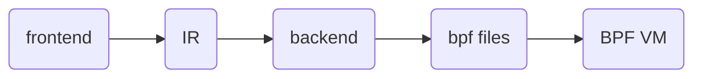

# ccbpf
A lightweight compiler and virtual machine designed for embedded systems. Inspired by eBPF, built for MCU.

## Overview

This project is a lightweight language runtime designed for embedded systems— a compiler and virtual machine that can run on MCUs, inspired by eBPF but smaller, simpler, and far more portable.

It enables developers to inject dynamic hook code into components such as RTOS kernels, network protocol stacks, and file systems without recompiling firmware, providing a flexible and safe extension mechanism for embedded environments.

Of course, it can also run on general‑purpose operating systems like Linux, where it can serve as an extensible scripting engine or a safe, embeddable runtime for dynamic application logic.

## design



The documents:   [设计文档](docs/中文/设计文档.md)

## use

edit:

```c
struct udp_hdr {
    int sport;
    int dport;
};

int hook(void *ctx, char *pkt) {
    struct udp_hdr *uh;
    uh =(struct udp_hdr *)&pkt[34];
    return 1;
}
```

run:

```
mkdir build
cmake ..
make
./ccbpf
```

like this:

```
skaiuijing@ubuntu:~/compiler/build$ ./ccbpf 
TOKEN: tag=288, str=struct
TOKEN: tag=268, str=udp_hdr
TOKEN: tag=282, str={
TOKEN: tag=257, str=int
TOKEN: tag=268, str=sport
TOKEN: tag=285, str=;
TOKEN: tag=257, str=int
TOKEN: tag=268, str=dport
TOKEN: tag=285, str=;
TOKEN: tag=283, str=}
TOKEN: tag=285, str=;
TOKEN: tag=257, str=int
TOKEN: tag=268, str=hook
TOKEN: tag=280, str=(
TOKEN: tag=268, str=void
TOKEN: tag=291, str=*
TOKEN: tag=268, str=ctx
TOKEN: tag=284, str=,
TOKEN: tag=257, str=char
TOKEN: tag=291, str=*
TOKEN: tag=268, str=pkt
TOKEN: tag=281, str=)
TOKEN: tag=282, str={
TOKEN: tag=288, str=struct
TOKEN: tag=268, str=udp_hdr
TOKEN: tag=291, str=*
TOKEN: tag=268, str=uh
TOKEN: tag=285, str=;
TOKEN: tag=268, str=uh
TOKEN: tag=294, str==
TOKEN: tag=280, str=(
TOKEN: tag=288, str=struct
TOKEN: tag=268, str=udp_hdr
TOKEN: tag=291, str=*
TOKEN: tag=281, str=)
TOKEN: tag=261, str=&
TOKEN: tag=268, str=pkt
TOKEN: tag=302, str=[
TOKEN: tag=273, str=34
TOKEN: tag=303, str=]
TOKEN: tag=285, str=;
TOKEN: tag=286, str=return
TOKEN: tag=273, str=1
TOKEN: tag=285, str=;
TOKEN: tag=283, str=}
TOKEN: tag=0, str=#0
[PP] block root stmt=0xf7df60 tag=18
[PP] root stmt=0xf7df60 tag=18
L1:
[IR] LABEL L1
L3:
[IR] LABEL L3
[IR] MOVE  t1 <- 1
[IR] EMIT RET t1
[IR] RET t1
L2:
[IR] LABEL L2
patch_jumps: pj_count=0, insn_count=4
BPF program (4 insns):
  0: code=0x0000 jt=0 jf=0 k=1
  1: code=0x0002 jt=0 jf=0 k=9
  2: code=0x0060 jt=0 jf=0 k=9
  3: code=0x0016 jt=0 jf=0 k=0
Wrote out.ccbpf (4 instructions)
result = 1
```

