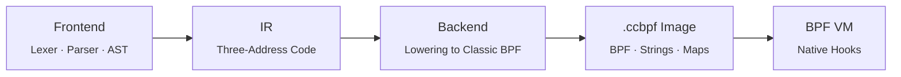

# ccbpf — A tiny eBPF-like system for MCUs

[中文介绍](docs/中文/readme中文.md)

ccbpf is a minimal dynamic‑programming component designed for **MCU / RTOS / bare‑metal systems**.
 It consists of a **C‑subset compiler** and a **BPF virtual machine**, inspired by Linux eBPF but smaller, simpler, and far more portable.

Its core mission is simple:

**Bring Linux‑style runtime code loading to MCUs — without reflashing firmware.**


```mermaid
graph LR
    A["Frontend<br/><sub>Lexer · Parser · AST</sub>"] 
        --> B["IR<br/><sub>Three‑Address Code</sub>"]
        --> C["Backend<br/><sub>Lowering to Classic BPF</sub>"]
        --> D[".ccbpf Image<br/><sub>BPF · Strings · Maps</sub>"]
        --> E["BPF VM<br/><sub> Native  Hooks</sub>"]

```


# Why ccbpf?

Traditional MCU firmware is static:
 update = recompile + flash + reboot.

ccbpf provides a **simple, verifiable, extremely lightweight** runtime‑loadable mechanism for:

- Inserting hooks into **RTOS kernels**
- Filtering, monitoring, and modifying data in **protocol stacks**
- Extending behavior in **file systems / drivers**
- Distributing logic across nodes (e.g., the lttit project)

In short:
 **No reboot. No rebuild. No reflashing.**

# ccbpf vs. Linux eBPF

| Feature      | Linux eBPF      | ccbpf                      |
| ------------ | --------------- | -------------------------- |
| Runtime      | Linux kernel    | MCU / RTOS / bare‑metal    |
| Complexity   | High            | Minimal                    |
| Toolchain    | LLVM/Clang      | Built‑in C subset compiler |
| Safety       | Verifier        | Language + VM limits       |
| Program Type | Many            | Hook programs              |
| Footprint    | MB‑level        | KB‑level                   |
| Portability  | Linux‑dependent | Fully platform‑agnostic    |

**eBPF makes Linux programmable;
 ccbpf brings the same idea to MCUs.**

# Design Highlights

ccbpf is not a port of eBPF — it is a ground‑up minimal design for MCUs:

- Restricted C subset (no loops, no pointer arithmetic)
- Tiny BPF VM (a few KB)
- Loadable program format
- Pluggable hook mechanism
- Simple map interface
- Fully platform‑independent (Linux / RTOS / bare‑metal)

Design goals:

- **Simple implementation**
- **Predictable behavior**
- **Easy verification**
- **Tiny footprint**
- **Embedded‑friendly**

# Memory Usage

- Compiling ~15 C statements on a 20KB‑RAM MCU: **~8KB**
- Compiling ~100 statements → 397 BPF instructions: **<60KB peak**
- VM running <200 instructions: **1–2KB RAM**


# Quick Run Demo

```bash
git clone https://github.com/skaiui2/ccbpf.git
cd ccbpf
chmod +x *.sh
```

## Dynamic Program Injection Demo

Open two terminals: one runs nodeA, the other runs nodeB.

Run nodeA:

```bash
./run_nodeA.sh
```

You will then see some output information.

This indicates that the nodeA program is running, and it is counting each UDP packet.

```
skaiuijing@skaiuijing-virtual-machine:~/Documents/ccbpf_git/ccbpf/nodeB/build$ ./run_nodeA.sh
[sudo] password for skaiuijing: 
[wirefisher] pps=1, bps=208
[wirefisher] pps=36, bps=7488
[wirefisher] pps=37, bps=7696
[wirefisher] pps=36, bps=7488
[wirefisher] pps=36, bps=7488
[wirefisher] pps=40, bps=8320
[wirefisher] pps=39, bps=8112
[wirefisher] pps=37, bps=7696
```

The demo program we inject implements a token-bucket rate limiting algorithm. Run:

```bash
./attach.sh
```

You will then see a series of compiler outputs, and you will observe that the output of nodeA changes immediately:

```
[wirefisher] pps=37, bps=7696
[wirefisher] pps=40, bps=8320
[hook] ATTACH hook_udp_input (prog=0x607398e83968)
now_time=32082220
tokens=0
last_ts=0
tokens2=3000
[PASS] sport=10000 dport=20000 len=208 tokens=2792
now_time=32082229
tokens=2792
last_ts=32082220
add=45
tokens2=2837
```

The count statistics will continuously update, while UDP packet source and destination ports are parsed.

Since the generated packets use fixed source and destination ports (with different sizes), only the counters will change.

### Unload Program

Use the following command to detach the BPF program:

```bash
./detach.sh
```

We will observe that the output of nodeA returns to normal:

```
last_ts=32096900
add=80
tokens2=976
[DROP] sport=10000 dport=20000 len=208
[hook] DETACH hook_udp_input
[wirefisher] pps=37, bps=7696
[wirefisher] pps=34, bps=7072
[wirefisher] pps=34, bps=7072
[wirefisher] pps=34, bps=7072
[wirefisher] pps=35, bps=7280
[wirefisher] pps=35, bps=7280
[wirefisher] pps=35, bps=7280
[wirefisher] pps=38, bps=7904
[wirefisher] pps=38, bps=7904
```

## Execution Migration Demo

In this demo, the program executes several steps on nodeC, and then migrates to nodeD to continue execution.

Start the receiving process first:

```bash
./run_nodeD.sh
```

Then in another terminal, run nodeC:

```bash
./run_nodeC.sh
```

You will see that after nodeC starts, the output is:

```
nodeC: running....
nodeC: 1
nodeC: 2
nodeC: 3
nodeC: 4
nodeC: 5
nodeC: migration_start
nodeC: migrate PC is 87
```

Then nodeD continues printing:

```
nodeC: migration_end
nodeC: 6
nodeC: 7
nodeC: 8
nodeC: 9
nodeC: 10
nodeC: 11
nodeC: ok!!!
nodeD: finished 0
```

This demonstrates execution migration: the virtual machine is suspended, packaged, and then resumed on nodeD to continue execution.

# Repository Layout

| Path | Purpose |
| --- | --- |
| `ccBPF/` | Core C-subset compiler (frontend, IR, backend), image format, and BPF VM. |
| `mg/` · `lib/` | Memory allocators and shared containers/utilities used by the compiler and runtime. |
| `nodeA/` · `nodeB/` | Host dynamic-extension demo: nodeA compiles and sends programs; nodeB runs the UDP hook host. |
| `nodeC/` · `nodeD/` | Host execution-migration demo: nodeC starts the computation; nodeD receives and resumes it. |
| `demo/ccbpf_mcu/` | STM32F103C8T6 firmware with the compiler, VM, filesystem, shell, and editor. |
| `demo/demo1/` · `demo/demo2/` | Standalone demo integrations: dynamic attachment and SCP-based multi-node communication, respectively. These contain their own component versions. |
| `ccbpf_file/` | Example source programs for filtering and performance exploration. |
| `cdb/` | Clang-based source instrumentation tool for inserting hooks. |
| `experiments/migration/` | Migration reproduction programs, experiment runner, and recorded results. |
| `docs/` | English/Chinese documentation and the system paper in `docs/papers/`. |

The root-level `hello.bpf` and `migrate.bpf` are inputs for the quick-run demos. The shell scripts launch, attach, or detach those demos; `gdb.py` provides a GDB structure-member watch command.

# Documentation

| Read or run | English | 中文 |
| --- | --- | --- |
| Source language, compiler APIs, VM, and hooks | [Usage](docs/English/usage.md) | [使用文档](docs/中文/使用文档.md) |
| Compiler design and source-to-execution example | [Design](docs/English/design.md) | [设计文档](docs/中文/设计文档.md) |
| Execution migration, hardware integration, and reproduction | [Migration guide](docs/English/execution-migration.md) | [执行迁移设计与复现](docs/中文/执行迁移设计与复现.md) |
| STM32 firmware project | [STM32F103C8T6 demo](demo/ccbpf_mcu/) | [STM32F103C8T6 工程](demo/ccbpf_mcu/) |

- System paper: [ccBPF: An Embedded C Compiler and Runtime for Dynamic Extension and Execution Migration](docs/papers/ccBPF-Compiler-Runtime-and-Migration.pdf) · [LaTeX source](docs/papers/ccBPF-Compiler-Runtime-and-Migration.tex).
- Reproduce migration: [instructions and results](experiments/migration/README.md) · [single-program check](experiments/migration/migration_reproduce.c) · [full experiment runner](experiments/migration/run_experiments.py).
- Recorded measurements: [summary](experiments/migration/results/2026-10-04/summary.json), [correctness](experiments/migration/results/2026-10-04/correctness.csv), [timings](experiments/migration/results/2026-10-04/timings.csv), and [allocations](experiments/migration/results/2026-10-04/heap.csv).

Run the full host experiment from the repository root with Python 3 and a GCC-compatible compiler:

```sh
python experiments/migration/run_experiments.py --cc gcc --out /tmp/ccbpf-migration-results
```

On Windows, use a MinGW compiler path and an external output directory; the [experiment instructions](experiments/migration/README.md) include a PowerShell example. Generated executables, inputs, checkpoints, and logs stay in that output directory.

