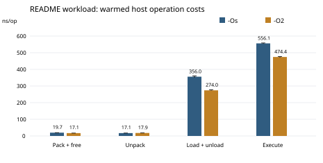

# ccBPF Execution Migration: Design, Implementation, and Reproduction

[中文](../中文/执行迁移设计与复现.md) · [System paper](../papers/ccBPF-Compiler-Runtime-and-Migration.pdf)

## Overview

Execution migration moves a running program to another device without restarting its computation. ccBPF compiles the program into bytecode and retains its instruction position, registers, local variables, and intermediate values in VM state. When the program calls `migrate()`, the VM completes that host call, records the next instruction, and returns control to the host. The host transfers the program image and state; the destination loads the image, restores the state, and continues.

This guide explains the data structures and algorithms behind two integrations: the repository's nodeC → nodeD host demonstration and LTTit's Pico 2W → STM32F103C8T6 hardware demonstration. The reproduction programs link the existing compiler and VM and test continuity using the root `migrate.bpf`. In the recorded Windows x64, MinGW GCC 13.1.0, `-Os` configuration, it produces 200 instructions, a 1,695-byte image, and a 528-byte context. The resumed instruction is 87; destination output continues from 6 through 11, the final state matches the local baseline, and the return value is zero. Extended experiments cover 7,518 checkpoint restorations, two optimization levels, and ten fresh-process handoffs. The new measurements do not include board-to-board latency, MCU peak RAM, or failure recovery.

## 1. What Migration Preserves

Dynamic loading changes which program can execute. Migration changes where an execution that has already begun continues. Transferring source or bytecode alone starts a new invocation. Saving only source variables also omits the instruction position and live intermediate values. Copying a native CPU stack would additionally depend on the instruction set, calling convention, and address layout.

ccBPF instead keeps the computation in explicit interpreter state. A compatible destination can resume bytecode without moving the original CPU stack. Files, devices, network sessions, and external data still require host-level handling.

The demonstrations request migration cooperatively through `migrate()`. `ccbpf_vm_step()` also saves state at an instruction boundary when its budget expires, but nodeC/nodeD do not implement an automatic migration policy.

### 1.1 Prior Work and Scope

Maté (Levis and Culler, ASPLOS 2002) studied compact sensor-network VMs. Agilla studied mobile agents and coordination in sensor networks, including the IPSN/SPOTS 2005 work by Fok, Roman, and Lu. Moving computation between constrained devices is an established research objective.

This guide focuses on the concrete C-subset compiler, classic-BPF-style execution state, restoration after a Native call, and the two host integrations. Instruction-boundary tests and fresh-process restoration provide implementation evidence. No Maté or Agilla performance comparison was run. The system paper places these mechanisms in the wider history of code mobility, embedded BPF, and WebAssembly and supplies the references.

## 2. Two Demonstrations, Two Programs

| Scenario | Direction | Output and return | Evidence |
| --- | --- | --- | --- |
| ccBPF host demo | nodeC → nodeD | Source: 1..5; destination: 6..11; return 0 | Root README, `migrate.bpf`, and nodeC/nodeD sources |
| LTTit hardware demo | Pico 2W → STM32F103C8T6 | Source: 1..4; destination: 5, 6, 1129; return 1129 | Existing hardware demonstration, [video](https://github.com/skaiui2/lttit#demo-video), and integration sources |
| Single-program reproduction | Separately loaded source and destination program objects in one process | Combined output 1..11; checkpoint and final-state comparisons pass; return 0 | `experiments/migration/migration_reproduce.c` |

Start nodeD first because it is the receiver. nodeC begins computation and sends the continuation to nodeD. The destination's print callback still uses the literal prefix `nodeC:`, so that prefix does not identify the executing node.

The hardware demonstration is an existing record, not a newly instrumented board experiment. The single-process check tests image reloading and snapshot round trips without a network or serial transport.

## 3. Data Structures

### 3.1 VM Context

The context in `ccBPF/cbpf.h` is:

```c
#define CCBPF_STACK_SIZE (512)

struct ccbpf_ctx {
    uint32_t A;
    uint32_t X;
    uint32_t pc;
    uint32_t ret;
    uint8_t  mem[CCBPF_STACK_SIZE];
};
```

| Field | Preserved value | Role on restoration |
| --- | --- | --- |
| `A/X` | Working registers | Complete an operation or store a host-call result still held in a register |
| `pc` | Next instruction index | Select the destination's next instruction |
| `ret` | VM return value | Preserve the return-state value |
| `mem` | Locals, temporaries, and spilled Native arguments | Preserve program data |

`CCBPF_STACK_SIZE` is a build configuration, not an instruction-set constant. Changing it requires compatible compiler layout and sender/receiver configurations. For capacity B, the context contains four 32-bit fields and B bytes of working memory: B+16 bytes before ABI padding. The recorded configuration uses B=512 and `sizeof(ccbpf_ctx)=528`.

The structure has no C pointer fields. Its entire working-memory array is copied: copying only the example's variable `a` would lose compiler-generated temporaries. Context size alone is not total migration RAM.

### 3.2 Image and Loaded Program

```c
struct bpf_insn {
    unsigned short code;
    unsigned char jt;
    unsigned char jf;
    long k;
};

struct ccbpf_program {
    struct bpf_insn *insns;
    size_t insn_count;
    uint8_t *data;
    size_t data_size;
    uint32_t entry;
    int string_count;
    char **strings;
    void *ctx;
};
```

The image contains instructions and referenced strings. `ccbpf_load_from_memory()` constructs a destination-local `ccbpf_program` and allocates and copies its instruction and string storage. Source pointers cannot be transferred as loaded-program pointers. `ccbpf_unload()` releases the reconstructed objects.

The snapshot excludes the image, Native registry, input frame, data behind `prog.ctx`, maps, file handles, and device state. The example uses local arithmetic and printing, so image and VM context preserve its computation. Programs with external mutable dependencies need to restore those dependencies separately.

### 3.3 Native Bindings

```c
typedef uint32_t (*native_fn_t)(struct ccbpf_program *p,
                              uint32_t a0, uint32_t a1,
                              uint32_t a2, uint32_t a3);

struct native_entry {
    int func_id;
    int argc;
    native_fn_t fn;
};
```

The compiler resolves a function name to a Native ID. The VM resolves that ID to a local function. The demonstrations use `print=3`, `print_str=4`, and `migrate=8`. Each destination registers its own implementations; the transfer does not carry source function addresses. Both endpoints must agree on argument conventions and service semantics.

## 4. From Source Call to VM Suspension

### 4.1 Compiling `migrate()`

nodeC's `native_init_frontend()` registers `native_decl_register("migrate",8,0)`, placing a `NativeDecl` in `native_decl_table`. Compilation follows this path:

```text
compile_to_image()
  → compiler_init() → lexer_init() → lexer_set_input_buffer()
  → parser_new() → native_init_frontend() → parser_program()
      → parser_block_gen() → parser_stmt()
      → parser_bool() → parser_join() → parser_bitand() → parser_bitor()
      → parser_rel() → parser_expr() → parser_term() → parser_unary()
      → parser_postfix() → parser_factor()
      → hashmap_get(native_decl_table, "migrate")
      → builtin_call_new(name, native_id=8, argc=0, args)
      → Node.gen / expr_gen(TAG_BUILTIN_CALL)
      → ir_emit(IR_NATIVE_CALL)
  → frontend_destroy()
  → bpf_builder_init() → ir_mes_get() → ir_lower_program()
      → IR_NATIVE_CALL case → temp_slot() → bpf_builder_emit()
  → ir_free() → ccbpf_pack_memory()
```

`BuiltinCall` records the service ID, argument expressions, argument count, and result temporary. `expr_gen()` generates arguments before emitting `IR_NATIVE_CALL`. The backend places argument 0 in A and argument 1 in X; arguments 2 and 3 use scratch offsets 0 and 4. When arguments exist, it reloads argument 0 before the call. It emits `COP native_id`, followed by a store of the result from A into a temporary slot.

The expression-descent chain is the parser chain shown above. A no-argument `migrate()` constructs an ordinary call node; there is no separate migration expression parser.

In the recorded compilation of `migrate.bpf`:

```text
IR_NATIVE_CALL: native_id=8, argc=0, dst=20
86: COP 8
87: ST mem[144]    // 64 + 4 × t20
```

Instruction 87 still belongs to storing this call's result. Restoration must resume there, rather than repeat instruction 86 or skip directly to the next source-level print statement.

### 4.2 Recording the Next Instruction

`native_migrate()` returns zero; it does not serialize or transmit state. The COP case in `ccbpf_vm_step()` performs the suspension:

```c
A = e->fn(prog, a0, a1, a2, a3);

if (e->fn == native_migrate) {
    ctx->A = A;
    ctx->X = X;
    ctx->pc = pc + 1;
    return CCBPF_MIGRATE;
}
```

The VM reads `ins->k`, looks up `hashmap_get(native_table,id)`, invokes the registered function, stores its result in A, compares the function pointer, saves A/X and `pc+1`, and returns the migration status. The condition is `fn==native_migrate`, not a fixed ID of 8. An unregistered COP sets A to zero and continues; registering another function as ID 8 does not trigger this migration path.

At suspension the host call has finished, and scratch remains in `ctx.mem`. This example saves A=0, X=1, and pc=87. The destination uses the restored A to execute the result store into `mem[144]`. Registers are therefore as necessary as source-level variables.

### 4.3 Host Handling of Execution Status

| Status | Meaning | Host action |
| --- | --- | --- |
| `CCBPF_OK` | Instruction budget exhausted; context saved | Continue with the same context or yield to the scheduler |
| `CCBPF_FINISHED` | RET executed; result in `ctx.ret` | Record the result and finish |
| `CCBPF_MIGRATE` | Migration Native completed; VM suspended | Stop source execution, pack, and transfer |
| `CCBPF_ERROR` | VM error path reached | Stop and report |

The demo budget of 64 instructions is per step, not a whole-program limit. A migration driver retains `ccbpf_ctx` and calls `ccbpf_vm_step()`. `ccbpf_run_frame()` creates a fresh zeroed context and continues locally after migration events; it is not an interface for resuming a restored context.

## 5. Packing, Restoration, and Continuity

`ccbpf_ctx_pack()` reports `sizeof(*ctx)`, allocates with `heap_malloc()`, and copies the entire context with `memcpy()`. It returns zero on success and -1 on allocation failure. The caller releases the buffer with `heap_free()`.

`ccbpf_ctx_unpack()` first checks the length. A mismatch returns -1 without changing the destination. A matching length copies the bytes and returns zero. It does not validate the program counter or bind a snapshot to a particular image.

The format is a native C-structure copy, with no canonical byte order, version field, or architecture conversion. Packing is linear in context size; image loading and transfer additionally depend on image length. Peak RAM also includes loaded programs, transport buffers, and allocator overhead.

Continuity assumes identical restored `(A,X,pc,ret,mem)`, corresponding bytecode semantics, and matching future inputs and Native results. The next instruction then receives the same operands and yields the same successor state; repeating this argument gives the same execution suffix. This conditional execution-model argument is not a formal verification of the interpreter or external side effects.

## 6. Host Demo Implementation

### 6.1 Call Path and Protocol

```text
nodeD main() → recv_from_nodeC() → socket/bind/listen/accept
nodeC main() → compile_to_image() → ccbpf_load_from_memory()
             → ccbpf_vm_step() → CCBPF_MIGRATE
             → ccbpf_ctx_pack() → send_to_nodeD() → socket/connect/write
nodeD recv_from_nodeC() → read image and snapshot
      → ccbpf_system_init() → native_register_all()
      → ccbpf_load_from_memory() → ccbpf_ctx_unpack()
      → ccbpf_vm_step() → CCBPF_FINISHED
```

The transport is a local Unix-domain stream socket at `/tmp/ccbpf_migrate.sock`. Its framing is:

```text
native size_t image length | image | native size_t context length | context
```

The sender and receiver use individual `write/read` calls without handling partial transfers, length bounds, acknowledgments, or retries. A stream socket does not guarantee one complete application message per read. This demonstration framing needs additional protocol handling for deployment.

### 6.2 Image Ownership

In the root implementation, `ccbpf_pack_memory()` returns storage in `pack_region`. nodeC's `compile_to_image()` destroys that region through `bpf_builder_free()` while returning the image pointer. The later `heap_free(img)` also mismatches the region allocation. The reproduction helper keeps the image alive by copying it into independently owned storage before releasing the builder. The original demo sources are unchanged.

LTTit's packer uses a different heap-allocation implementation and does not have this same pack-region release sequence. Its ownership rules and API must be followed separately.

The original Linux demo starts in this order. For continuity checks against the current VM, use the independent reproduction in Section 8:

```sh
# Terminal 1, repository root
cmake -S nodeD -B /tmp/ccbpf-nodeD
cmake --build /tmp/ccbpf-nodeD
/tmp/ccbpf-nodeD/nodeD

# Terminal 2, repository root
cmake -S nodeC -B /tmp/ccbpf-nodeC
cmake --build /tmp/ccbpf-nodeC
/tmp/ccbpf-nodeC/nodeC "$PWD/migrate.bpf"
```

nodeC/nodeD's CMake files select Debug and `-O0`; their print callbacks wait one second. These settings make the demo observable and are not optimized migration benchmarks. Unix-domain socket code requires a POSIX environment and cannot be built directly with a native Windows toolchain.

## 7. LTTit Hardware Integration

### 7.1 From the Shell to STM32

The Pico stores source in a filesystem and compiles and runs it through the shell. A semaphore connects execution to a migration-sender task:

```text
Pico shell_main() → semaphore_create() → task_create(task_migrate_sender,...)
cmd_compile() → load_text_file_heap_fs() → parser_program()
              → ir_lower_program() → ccbpf_pack_memory() → fs_write()/fs_sync()
cmd_runbpf() → fs_open()/fs_read() → ccbpf_load_from_memory()
             → zero g_ctx → ccbpf_vm_step()
             → CCBPF_MIGRATE → semaphore_release(sem_migrate)
task_migrate_sender() → semaphore_take() → ccbpf_ctx_pack()
                      → assemble image and context
                      → rpc_call(RPC_OP_WRITE, "/root/nodeB/vm/migrate")
```

The RPC and destination paths are:

```text
rpc_call() → encode_request_tlv() → rpc_send_message()
           → transport / SCP / UART
rpc_on_data() → rpc_dispatch_message() → rpc_handle_request()
             → world RPC_OP_WRITE dispatch → file_ops.write
vm_migrate_register() → world_register("root/nodeB/vm/migrate",...)
vm_migrate_write() → validate payload length → copy image and context
                   → ccbpf_load_from_memory() → ccbpf_ctx_unpack()
                   → ccbpf_vm_step() → STM32 output
```

`/root/nodeB/vm/migrate` identifies the destination handler. Request data is:

```text
uint32_t image length | uint32_t context length | image | context
```

These are native representations. Data size is `8 + image_len + ctx_len`, excluding RPC/SCP/UART framing. This differs from the host demo's `size_t` stream format.

LTTit's `ccbpf_pack_memory(insns,count,out_len)` allocates the image using `heap_malloc()`; freeing the builder does not free it. The root packer has an additional capacity argument and uses a pack region. Their allocation and release contracts differ.

Relevant LTTit sources are `lttit/shell/source/shell.c`, `test/blink.c`, `test1/Core/Src/main.c`, `lttit/world/source/world.c`, and `lttit/CSC/ccrpc/source/rpc.c`. The VM restoration mechanism is shared in purpose; LTTit supplies transport and host resources.

### 7.2 Hardware Reproduction

The hardware program returns 1129 and is separate from the root counting demo:

```c
int hook(void *ctx)
{
    int a;
    a = 1; print(a);
    a = a + 1; print(a);
    a = a + 1; print(a);
    a = a + 1; print(a);
    migrate();
    a = a + 1; print(a);
    a = a + 1; print(a);
    a = a + 1123; print(a);
    return a;
}
```

LTTit's `test/` is the Pico firmware project; `test1/` is the STM32 project. Configure the ARM toolchains and flash through CLion or the documented tools. The [hardware quick start](https://github.com/skaiui2/lttit/blob/main/docs/English/quickStart.md) describes building and flashing. The Pico CMake configuration uses an absolute `PICO_SDK_PATH`, which must match the local SDK. Record the flashed revisions and optimization options.

| Connection | Wiring | Baud |
| --- | --- | --- |
| Pico → STM32 | GPIO4 TX → PA10 RX | 115200 |
| STM32 → Pico | PA9 TX → GPIO5 RX | 115200 |
| PC ↔ Pico shell | USB-serial TX → GPIO1 RX; RX → GPIO0 TX | 115200 |
| STM32 output | PA2 / USART2 TX → another USB-serial RX | 115200 |
| Ground | Common ground between endpoints | — |

After both firmwares initialize and the destination resource is registered, save the program as `migrate.bpf` in the Pico filesystem. Enter:

```text
compile migrate.bpf
runbpf migrate.ccbpf
```

`cmd_compile()` generates the `.ccbpf` filename. Expected Pico output is 1, 2, 3, 4; STM32 continues with 5, 6, 1129 and `STM32: finished 1129`. Record both serial logs, firmware revisions, and the image. This procedure follows the existing demonstration and source inspection; the host tests do not add board measurements.

## 8. Executable Reproduction and Results

### 8.1 Single-Program Check

`experiments/migration/migration_reproduce.c` links the current root compiler and VM without copying or modifying the VM. It:

1. Compiles the source once and retains an owned image copy.
2. Executes a local baseline, continuing in place after migration until return.
3. Loads a new source program, runs to migration, and checks five outputs and a COP 8 at `pc-1`.
4. Packs the context, unloads the source program, and overwrites the original context.
5. Loads a destination program, checks rejection of an incorrect snapshot length, restores the correct snapshot, and compares every state byte.
6. Frees the transfer buffer and continues; compares final A/X/pc/ret/mem with the baseline and checks output 1..11, each string marker once, and return zero.

Each reproduction starts a fresh process so compiler global counters and region handles are not treated as separate compiler instances. Print callbacks omit demonstration delays. This is a correctness check, not a timing benchmark.

For GCC/Clang in a POSIX environment, run from the repository root:

```sh
mkdir -p /tmp/ccbpf-migration-check
cc -std=c99 -Os -include string.h \
  -IccBPF -IccBPF/vm/bpf/include \
  -IccBPF/compiler/frontend/include -IccBPF/compiler/backend/include \
  -IccBPF/compiler/ir/include -Img/include -Ilib/include \
  experiments/migration/migration_reproduce.c \
  ccBPF/compiler/frontend/source/*.c ccBPF/compiler/backend/source/*.c \
  ccBPF/compiler/ir/source/*.c ccBPF/vm/bpf/source/*.c \
  mg/source/*.c lib/source/*.c -lm \
  -o /tmp/ccbpf-migration-check/reproduce
/tmp/ccbpf-migration-check/reproduce "$PWD/migrate.bpf"
```

`-include string.h` supplies string-function declarations without editing existing sources. The recorded environment is Windows x64 with MinGW GCC 13.1.0 and optimized compilation. It did not run Linux socket transfer. LP64 instruction layout differs from MinGW LLP64; use the sizes printed by the reproduction for the actual ABI. Windows users can run the full Python harness described in Section 10.4 and the [experiment instructions](../../experiments/migration/README.md).

### 8.2 Recorded Output

```text
source: runing....
source: 1
source: 2
source: 3
source: 4
source: 5
source: migration_start
CHECKPOINT pc=87 A=0 X=1 context=528 image=1695 insn_size=8 instructions=200
destination: migration_end
destination: 6
destination: 7
destination: 8
destination: 9
destination: 10
destination: 11
destination: ok!!!
PASS: restored state equals checkpoint; final state equals baseline; output=1..11; ret=0
```

Compiler diagnostics and baseline output are omitted here. `runing....` is the actual source string.

| Item | Recorded result | Interpretation |
| --- | --- | --- |
| Input | Original `migrate.bpf` | Original demonstration workload |
| Instructions | 200 | Includes arithmetic and printing |
| Migration / resume instruction | 86 / 87 | COP completed; its result store is next |
| Saved A / X | 0 / 1 | Native result and preserved X |
| Context | 528 bytes | Four scalar fields and the full configured scratch array |
| Instruction structure | 8 bytes | Recorded MinGW LLP64 layout |
| Image | 1,695 bytes | 28-byte header + 200×8 instructions + 67-byte string area |
| Image + context | 2,223 bytes | Excludes framing; not peak RAM |
| Restored state | All bytes equal checkpoint | More than a return-value comparison |
| Final state | All bytes equal baseline | A/X/pc/ret/mem agree |
| Output / return | 1..11 / 0 | First five outputs at source; last six at destination |

For an ABI with `sizeof(bpf_insn)=16`, the same counts imply `28+200×16+67=3295` image bytes. This is a layout calculation, not a second-platform measurement. Record file size, state size, framed transfer size, and peak RAM separately.

## 9. Implementation Boundaries

Native structure copies require compatible instruction layout, C `long` width, padding, byte order, working-memory capacity, variable/temporary layout, and Native argument semantics. Source portability alone does not make the present image an arbitrary cross-ABI format. Host inputs and external resources require reconstruction.

Snapshots have no version, checksum, or program identifier; unpacking only checks length. The loader and interpreter do not implement complete isolation for malicious inputs. Continuity assumes trusted valid images, a valid pc, successful allocations, and compatible dependencies.

The source stops before sending. The root transport has no acknowledgment, retry, or execution-ownership transaction. Disconnects, duplicates, destination power loss, and completed external effects have no automatic recovery guarantee. An LTTit RPC response is not a durable execution-ownership record.

The root demo and STM32 receiver do not unload programs on all completion paths. Repeated migration requires appropriate object release. `sleep/HAL_Delay` in output callbacks is an observation aid, not migration latency.

## 10. Extended Experiments

The recorded environment is Windows 11 build 26200, AMD64 Family 25 Model 80, and MinGW GCC 13.1.0. The original compiler and VM are linked unchanged. Builds use `-Os` and `-O2`, without LTO; each program is compiled once in a fresh process.

The 32-program corpus contains the root demonstration, a host execution of the hardware-demo source, six focused cases (early, late, two migrations, true branch, false branch, strings), and 24 arithmetic programs using seeds 0..23. Each generated case has 12 assignments, two migration requests, and a final print. A Python oracle computes expected returns independently. Divisors are nonzero, subtraction avoids negative intermediates, and arithmetic follows the VM's unsigned results.

### 10.1 Continuity and Fresh Processes

| Test | Recorded outcome | Check |
| --- | --- | --- |
| Programs × optimization levels | 64/64 pass | Expected return values |
| Independent checkpoint restoration | 7,518 pass | 3,759 reached pre-instruction boundaries per build |
| Repeated movement before every instruction | Another 7,518 pack/restore/reload operations | Final full context equals baseline |
| Source exit, new destination process | 10/10 pass | Source 1..5; destination 6..11; return 0 |
| Allocator free-byte balance | 64/64 pass | Fixture allocations released to the corresponding baseline |

The harness single-steps a baseline, records every reached pre-instruction state, then restores each and executes its suffix. It compares the final context byte by byte. Output uses a 64-bit rolling hash and event count; the observer begins with the baseline prefix state so it can check the suffix. This observer is test instrumentation, not automatically migrated host state, and hashing is not a collision-free proof. The root demo additionally checks its numeric output directly. True and false branch cases are separate tests, not exhaustive coverage of all inputs or unreachable instructions.

`process.c` writes an image and snapshot, then the source exits. A new destination process reads them, registers Native functions, and resumes. Test framing includes a magic value and two little-endian 32-bit lengths around the native image/context. Ten passing runs establish that this example does not need a living source address space. This is local file handoff, not serial/network performance or a replacement for the project transport.

### 10.2 Host Operation Times

`QueryPerformanceCounter` measures batches. Three warm-up batches are discarded; 31 batches are retained per operation. Each has 1,000 operations, except load/unload batches with 100. Values below are medians and P05/P95 of batch means, in ns. Percentiles use sorted index `floor(q×(n-1))`. They are neither individual-call tail latencies nor confidence intervals.

| Operation | -Os median [P05, P95], ns | -O2 median [P05, P95], ns |
| --- | --- | --- |
| Pack and free | 19.7 [19.7, 19.9] | 17.1 [16.9, 17.1] |
| Unpack | 17.1 [17.1, 17.3] | 17.9 [17.8, 18.0] |
| Load and unload | 356.0 [350.0, 361.0] | 274.0 [272.0, 278.0] |
| Complete execution | 556.1 [553.6, 558.6] | 474.4 [470.2, 477.7] |



Packing includes allocation, copying, observing a byte, and freeing. Unpacking includes length checking, copying, and volatile observation. Loading/unloading includes validation, allocation, copying, and release. Execution includes VM calls, Native lookup, output hashing, and local continuation at migration events. Terminal printing, process startup, and file handoff are excluded. The measurements repeatedly access warm data, do not subtract an empty-loop baseline, and do not control cold caches. Optimization builds run sequentially, so these are not controlled causal comparisons. They are desktop measurements, not STM32/Pico migration delays.

### 10.3 Allocation and Invalid Inputs

Loaded-program allocator charges are 1,856 bytes for the root demo, 1,000 for the host version of the hardware program, and 1,208 for `arithmetic_00`. Each recorded context is 528 bytes. Charges include allocation-block overhead but exclude the original image, compiler peak RAM, Native tables, C stack, observer arrays, and transport buffers.

Each of 64 runs performs seven boundary checks, totaling 448:

| Input | Observed behavior |
| --- | --- |
| Context length 0, one less, one more | All three rejected; destination unchanged |
| Correct length, altered scratch byte | Accepted; restored state changed |
| Correct length, pc=0xffffffff | Accepted by unpacker; invalid state not executed |
| Changed image magic | Loader returns NULL |
| Image truncated to one byte | Loader returns NULL |

Length checks work, but the unpacker does not check integrity or pc validity. No invalid-pc execution or arbitrary-bytecode fuzzing was performed. Fixture allocation balance does not imply that release omissions in the original demos are repaired.

### 10.4 Reproduce the Full Series

Python 3's standard library and a GCC-compatible compiler are sufficient. From the repository root:

```sh
python experiments/migration/run_experiments.py --cc gcc --out /tmp/ccbpf-migration-results
```

On Windows, provide the MinGW `gcc.exe` path if it is not on `PATH`, and choose an external output directory. The [experiment README](../../experiments/migration/README.md) includes a PowerShell command. The runner generates workloads, builds both optimization variants, runs correctness/timing tests and ten fresh-process handoffs, and writes logs, CSV files, and `summary.json`. Failure produces a nonzero exit status. Metadata records the toolchain, commands, source hashes, and Git revision. Timing need not repeat exactly; semantic assertions and state comparisons determine correctness.

Recorded [summary](../../experiments/migration/results/2026-10-04/summary.json), [correctness](../../experiments/migration/results/2026-10-04/correctness.csv), [timings](../../experiments/migration/results/2026-10-04/timings.csv), and [allocation data](../../experiments/migration/results/2026-10-04/heap.csv) remain in the repository. Generated source, logs, and checkpoint buffers are written to the external output directory.

## 11. Further Deployment Experiments

| Question | Method | Data to publish |
| --- | --- | --- |
| Continuity at varied migration points | Vary migration position, scratch values, arithmetic, and compatible Native calls | Source, image hash, pc, output, state comparisons |
| Suspension-to-resumption delay | Timestamp yield, packing, reception, and destination's first instruction using a shared or measured synchronized timebase | Timebase, samples, distributions; do not subtract unsynchronized board clocks |
| Resource costs | Measure compilation, execution, packing, transfer, and loading separately | Firmware, optimization, Flash, heap/stack high-water marks, payload lengths |
| Transport contribution | Compare local restore and UART/RPC transfers across payload sizes | Framing bytes, retries, throughput |
| Failure behavior | Truncation, mismatch, duplicates, disconnect, and allocation failure | Rejection/recovery and external effects |
| Supported board combinations | Record Pico → STM32 revisions and then test other directions | Formats, bindings, both endpoint logs |

The host study provides raw measurements and an independent arithmetic oracle. Its limits are one desktop ABI, one compiler version, short programs, trusted state, and warm batch-mean timing. It supports continuity and local component-cost claims for the tested corpus. Board delay, energy, throughput, and recovery require their own hardware experiments.

## 12. Materials and Revisions

The system paper and this guide share mechanism and experiment definitions. Source materials include Skai Uijing's *ccBPF: A Portable and Reproducible Embedded Programming Artifact for MCU-Class Systems* and *Live Migration of Compiled ccBPF Programs Across Heterogeneous MCUs Using LTTit*.

Inspected ccBPF revision: `18aad430889bab27b75a7ef736e8948eb658acd0`. Inspected LTTit revision: `b0941d48cab821e5e6f2000c6eff24ee83b26fb2`. Board reproduction must record the actual flashed revisions.

For historical BPF background, see McCanne and Jacobson, [The BSD Packet Filter: A New Architecture for User-level Packet Capture](https://www.usenix.org/conference/usenix-winter-1993-conference/bsd-packet-filter-new-architecture-user-level-packet), Winter USENIX 1993. Its register-based filter machine supplies background; ccBPF's explicit VM state and host integrations implement the migration path described here.
